<p align="center">
  
</p>

# MR-POS - Modern Point of Sale System

MR-POS is a powerful, cross-platform Point of Sale (POS) system designed for modern businesses. Built with **Flutter**, it offers a seamless experience across Windows, macOS, and Android. It provides real-time data synchronization using **Firebase**, intuitive menu management, a robust ordering system, and comprehensive reporting.

---

## Key Features

### Powerful Dashboard
- **Real-time Analytics**: Track daily sales, monthly revenue, and table occupancy at a glance.
- **Dynamic Charts**: Interactive revenue and sales trends for the last 7 days/months.
- **Popular Dishes**: Visibility into top-performing menu items by serving count and order frequency.

### Dynamic Menu Management
- **Categorized Menu**: Organize items into Custom Categories (Pizza, Seafood, Drinks, etc.).
- **Stock Tracking**: Real-time status indicators (In Stock, Low Stock, Out of Stock).
- **Menu Types**: Support for different menu types like "Normal Menu", "Kids Menu", etc.
- **Quick Actions**: Easy modal-based interface to add/edit items and categories.

### Advanced Ordering System
- **Responsive Cart**: Quick-add items, adjust quantities, and manage orders with a sliding sidebar.
- **Order Tracking**: Filter and manage orders by status (Awaited, Confirmed, Cancelled, Failed).
- **Flexible Payments**: Support for Cash and Card payments with a polished modal interface.
- **PDF Receipts**: Generate and print professional PDF receipts for customers.

### Reservation Module
- **Calendar View**: Manage upcoming reservations with a time-slotted grid.
- **Customer CRM**: Maintain customer contact details and guest counts.
- **Real-time Sync**: Instant updates across all devices when a reservation is made.

### Dual Theme Support
- **Glassmorphism Design**: Premium UI with smooth transitions and blur effects.
- **Dark Mode**: Eye-friendly dark interface for low-light environments.
- **Light Mode**: Clean, high-contrast look for daytime operations.

---

## Visual Gallery

### Dashboard & Analytics
| Today's Overview | Dark Mode Trends | Stats Breakdown |
| :---: | :---: | :---: |
|  |  |  |
|  |  | |

### Menu Management
| Category List | Create Category | Create Menu Item |
| :---: | :---: | :---: |
| 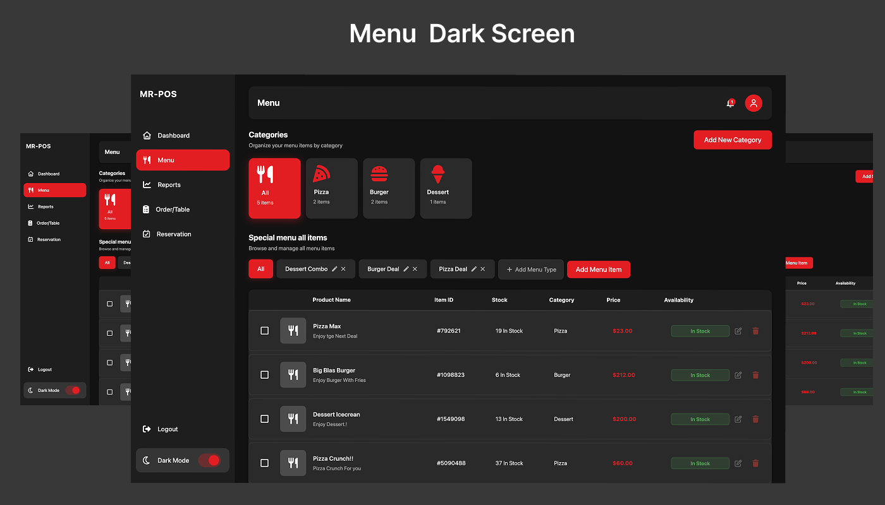 | 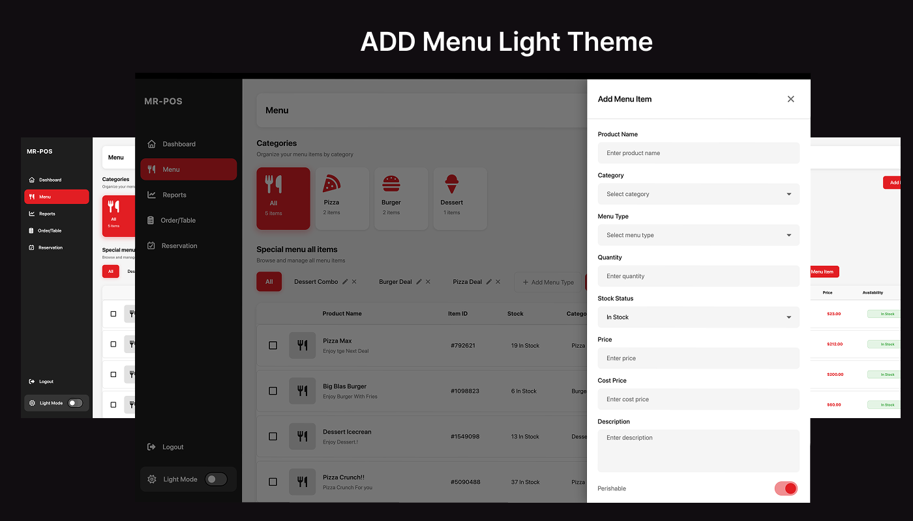 |  |
|  | 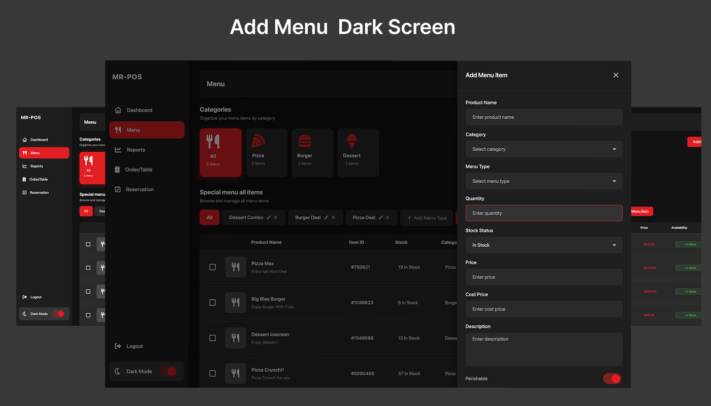 |  |

### Order System & Cart
| Order Selection | Screen Layout | Order Tracking |
| :---: | :---: | :---: |
| 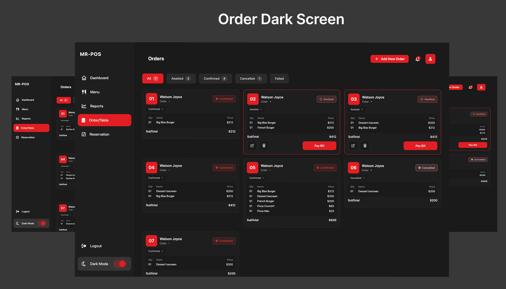 | 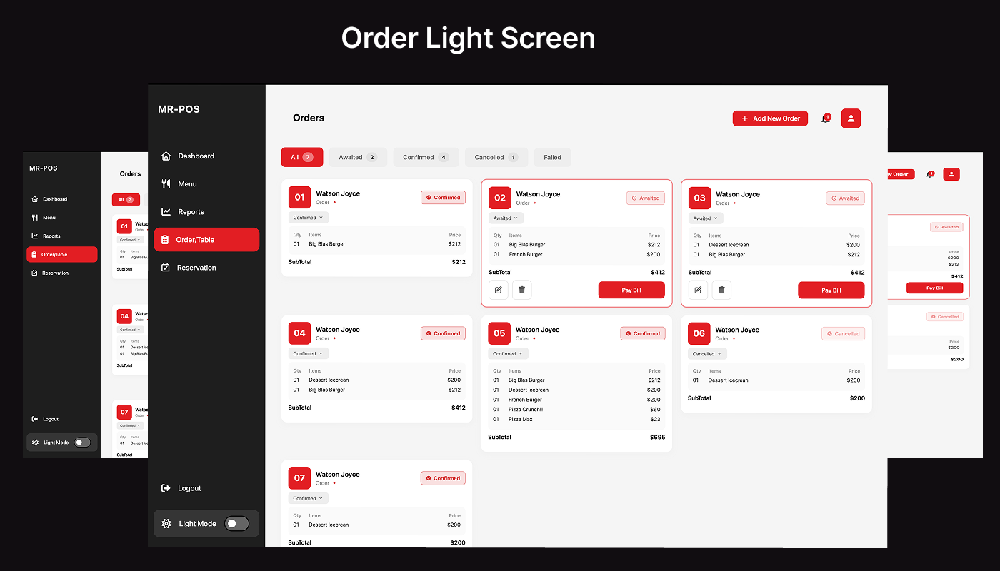 | 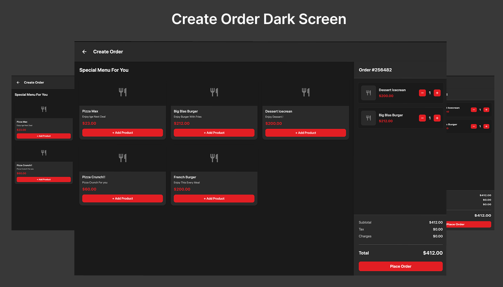 |
| | | 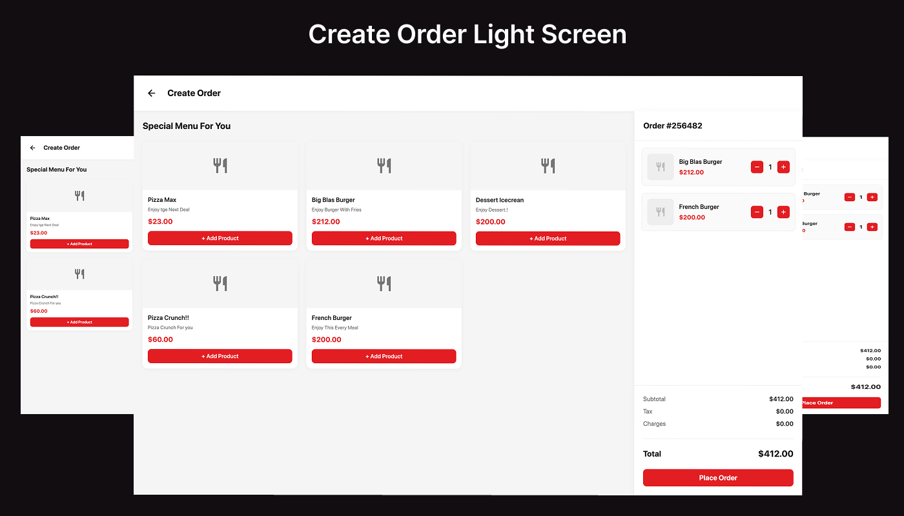 |

### Payment & Receipts
| Payment Options | Cash/Card Process | Digital Receipts |
| :---: | :---: | :---: |
| 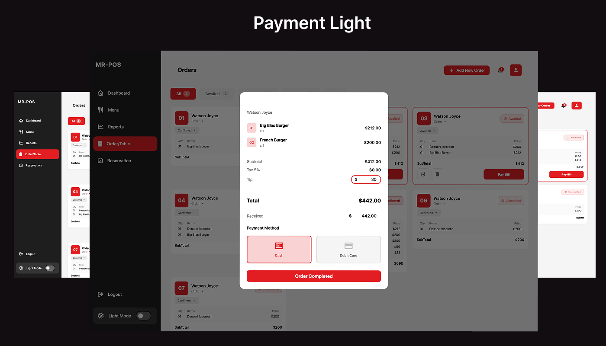 |  | 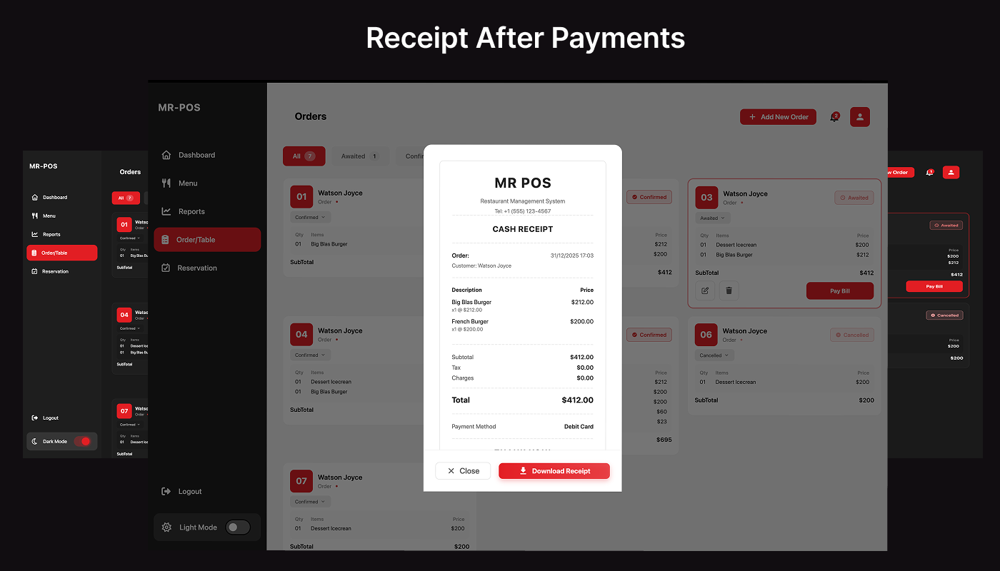 |
| 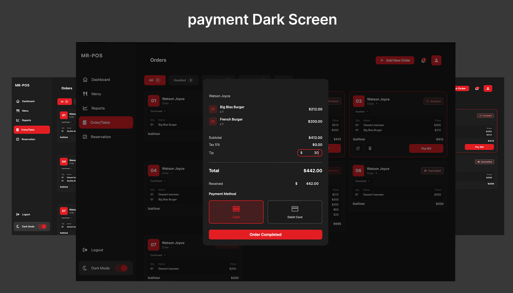 | 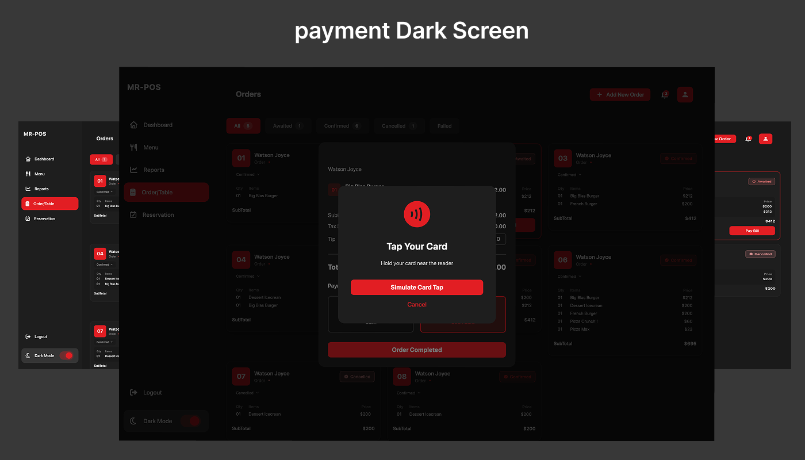 | 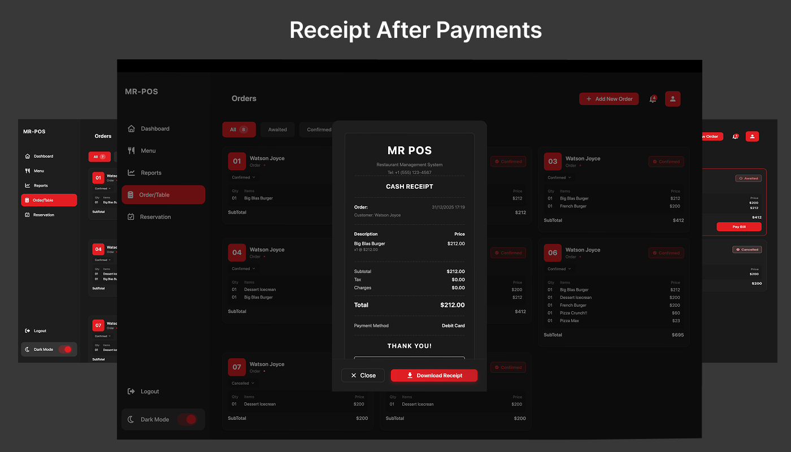 |

### Reservations
| Reservation Grid | Adding Reservation | Reservation Details |
| :---: | :---: | :---: |
| 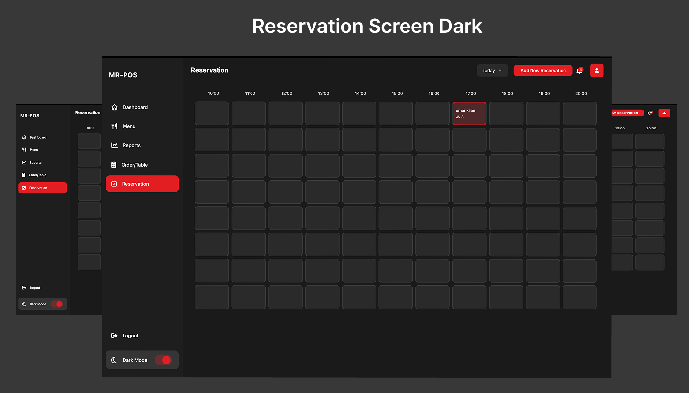 | 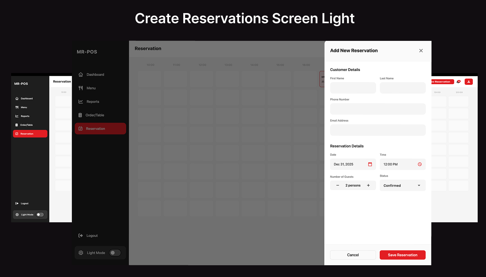 | 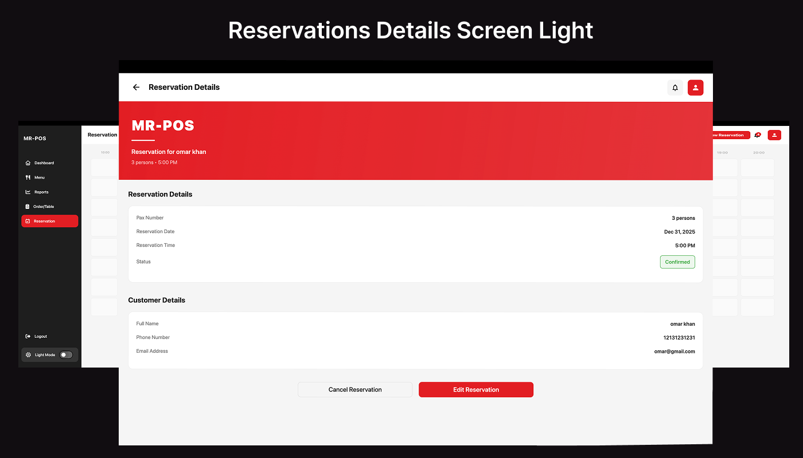 |
|  | 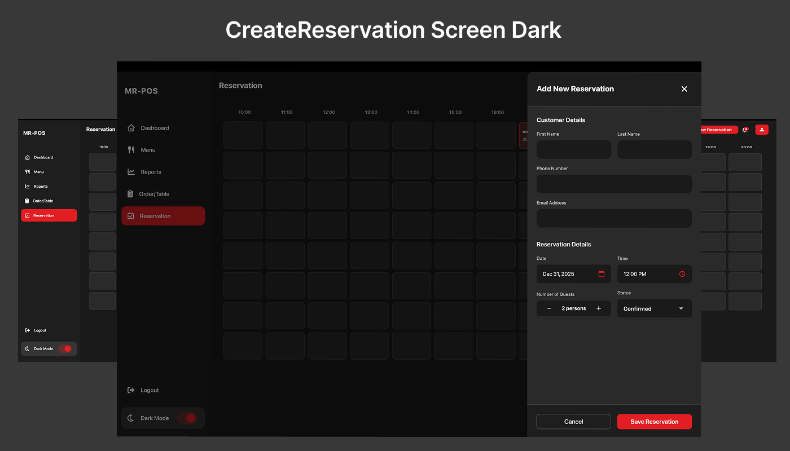 | 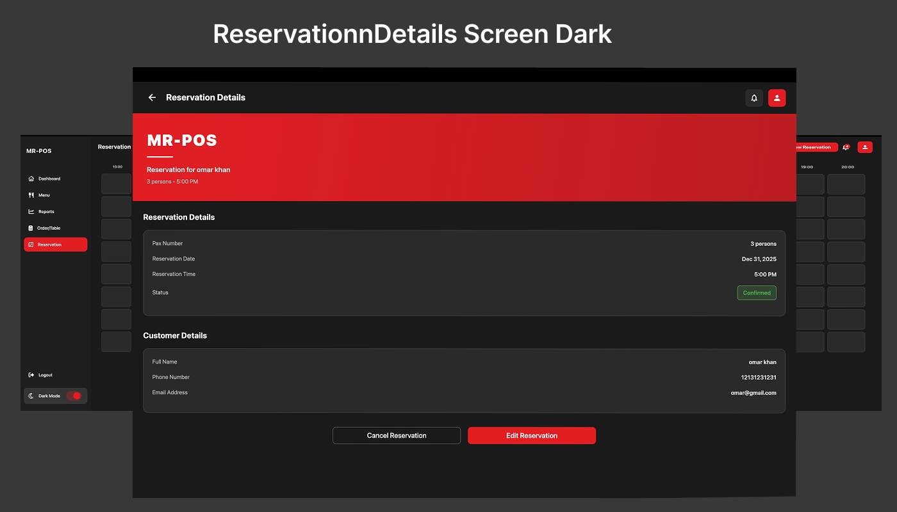 |

### Notifications
| List View |
| :---: |
| 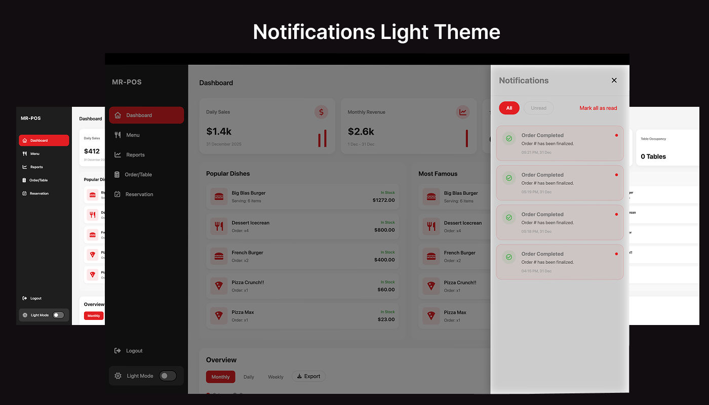 |

---

## Tech Stack

- **Framework**: [Flutter](https://flutter.dev) (v3.x)
- **State Management**: [BLoC / Cubit](https://pub.dev/packages/flutter_bloc)
- **Backend**: [Google Firebase](https://firebase.google.com)
  - Cloud Firestore (Real-time Database)
  - Firebase Messaging (Push Notifications)
  - Firebase Auth (Authentication)
- **Local Storage**: [Shared Preferences](https://pub.dev/packages/shared_preferences)
- **Utilities**: 
  - [Intl](https://pub.dev/packages/intl) for formatting
  - [Google Fonts](https://fonts.google.com)
  - [PDF](https://pub.dev/packages/pdf) for receipt generation

---

## Setup Guide

### Prerequisites
- Flutter SDK installed on your machine.
- A Firebase account.
- Android Studio / Xcode for mobile development.

### 1. Clone the Repository
```bash
git clone https://github.com/umarKhan1/MR-POS.git
cd MR-POS
```

### 2. Firebase Configuration
This is an open-source project, so sensitive configuration files are excluded for security. **You must set up your own Firebase project.**

1.  Create a project on the [Firebase Console](https://console.firebase.google.com/).
2.  Enable **Anonymous Authentication** (or Email/Password).
3.  Enable **Cloud Firestore** in test mode.
4.  Run the FlutterFire CLI to generate `lib/firebase_options.dart`:
    ```bash
    flutterfire configure
    ```
5.  Download and place the platform-specific files:
    - `android/app/google-services.json`
    - `ios/Runner/GoogleService-Info.plist`
    - `macos/Runner/GoogleService-Info.plist`

### 3. Install Dependencies
```bash
flutter pub get
```

### 4. Run the Application
```bash
flutter run
```

---

## Security Best Practices
- Never commit your `firebase_options.dart`, `google-services.json`, or `.env` files to a public repository.
- Use Firebase Security Rules to restrict access to your Firestore database.

---

## Contributing
Contributions are welcome! Please feel free to submit a Pull Request.

1. Fork the Project
2. Create your Feature Branch (`git checkout -b feature/AmazingFeature`)
3. Commit your Changes (`git commit -m 'Add some AmazingFeature'`)
4. Push to the Branch (`git push origin feature/AmazingFeature`)
5. Open a Pull Request

---

## Authentication & Login

MR-POS supports two modes of authentication to make it easy for both developers and production users.

### Demo Mode (Local)
Out of the box, the project is configured with a **Mock Authentication** layer. This allows you to explore all features immediately after cloning without setting up Firebase first.

- **Email**: `admin@mrpos.com`
- **Password**: `admin123`

### Production Mode (Firebase)
To use real Firebase Authentication:
1.  Go to `lib/core/di/app_providers.dart`.
2.  Switch `MockAuthRepository()` to `FirebaseAuthRepository()`.
3.  In your **Firebase Console**, enable the **Email/Password** sign-in provider.
4.  Create a user account manually or implement a registration flow.

---

## Author

Developed with ❤️ by **Muhammad Omar**.

Connect with me:
- [LinkedIn](https://www.linkedin.com/in/muhammad-omar-0335/)
- [GitHub Profile](https://github.com/umarKhan1)

---

## License
Internal / Open Source. See `LICENSE` for more details.
